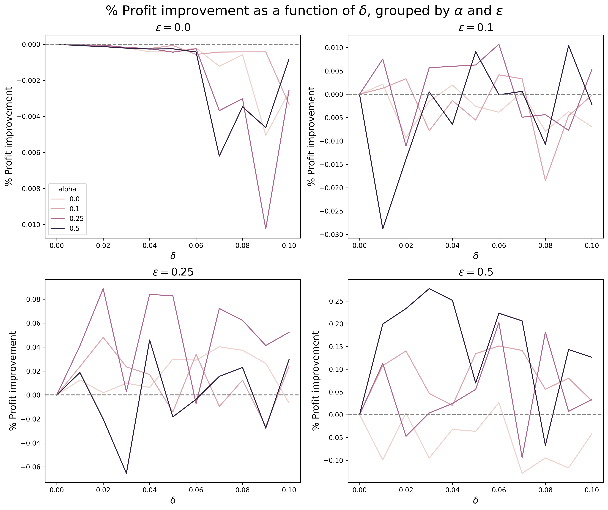
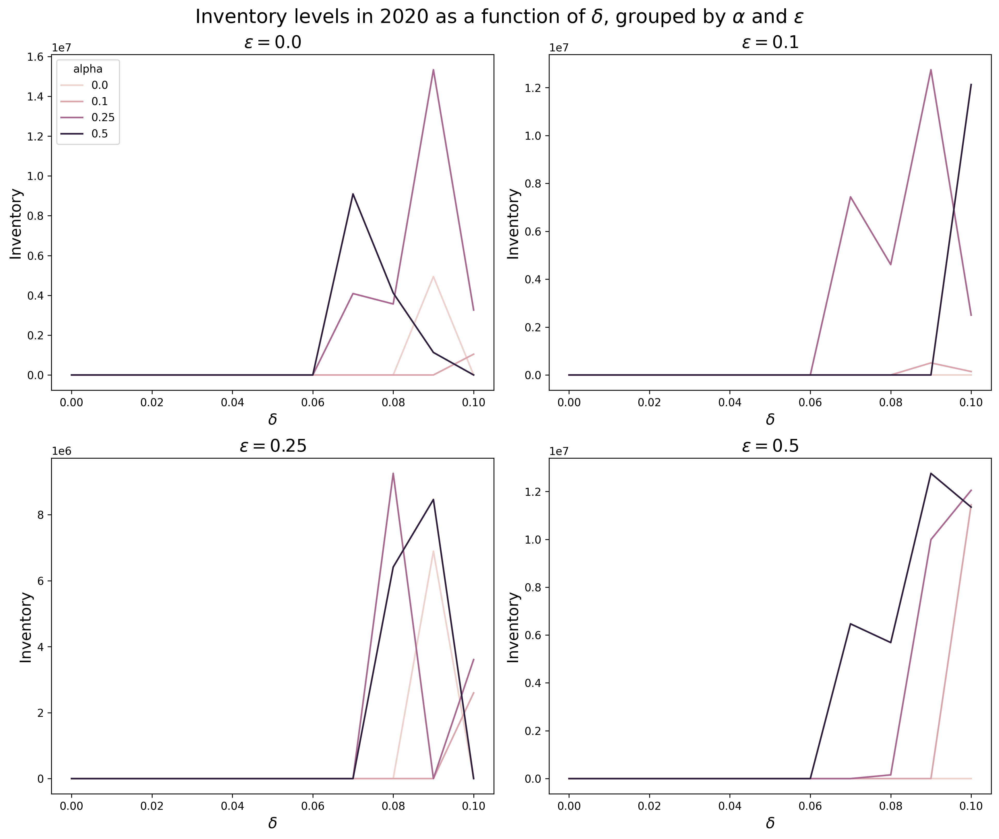

# Is Just-in-Time really the most profitable supply chain strategy for Nike in an uncertain world?

Final Project, MIT 15.093 - Optimization Methods  
Team Members: [Jason Jia](https://www.linkedin.com/in/jasonjiajs/), [Virginia Maguire](https://www.linkedin.com/in/virginia-maguire/)

## Summary
Even with a blunt robust strategy, it can be more profitable for firms to maintain healthier inventory levels and source from more diverse suppliers. While costly to guard against supply chain uncertainty, the benefits come through during disruptions such as Covid-19, which should not be dismissed as a one-off event. If businesses such as Nike are still adopting a Just-in-Time model, they should take immediate action to transition towards a more resilient, “Just-in-Case” strategy.

## Problem and Motivation
The Just-in-Time (JIT) system is a well-known lean manufacturing system pioneered by Toyota that seeks to eliminate waste, which often implied minimizing inventory levels and finding the lowest cost suppliers. While many businesses have pursued JIT as their supply chain strategy, low inventory levels and supplier concentration caused severe shortages when factories and transportation routes were shut down during Covid-19. As seen from a spike in supply chain resilience articles from McKinsey, Bain and BCG during 2021-2023, the missed sales opportunity and reputational damage from unmet demand has generated strong business interest to re-evaluate if JIT is truly the best supply chain strategy.

  
   
  

However, to the best of our knowledge, there is no publicly available research quantifying the potential profitability improvements under different conditions. This is why we want to explore to what extent do disruptions in supply (modelled by ε) and penalties for unmet demand (modelled by α) affect differentially robust supply chain strategies for Nike (modelled by δ), in terms of profit, inventory levels and concentration of suppliers.

## Data

We use 3 main data sources for this project: Nike Factory Worker Data, Nike 10-K Reports, Drewry World Container Index (for shipping costs).

## Methods

### Decision Variables

### Notation

## Model

### Starting formulation

### Robustness: Incorporating Uncertainty in Availability

### Evaluation of various strategies under different settings

## Key Findings
1. With greater unexpected supply chain disruptions, a somewhat robust strategy almost always performs better than a non-robust strategy. As ε increases, the percentage profit improvement of a δ-robust strategy compared to a non-robust strategy (δ = 0) tends to be increasingly positive.

2. In line with expectations, inventory levels right before Covid-19 rise as Nike’s supply chain strategy becomes more robust, up to a point.

3. Also in line with expectations, regional Herfindahls right before Covid-19 decrease as Nike’s supply chain strategy becomes more robust, up to a point. This points to regionalization, a strategy to pursue greater supplier diversification at a regional level.

## Impact and Conclusion
Our model showed that even with a blunt robust strategy, it can be more profitable to maintain healthier inventory levels and source from more diverse suppliers. In practice, this could involve actions such as dual sourcing of raw materials, increasing inventory of critical products, near-shoring and increasing supplier base, as well as regionalization.
While costly to guard against supply chain uncertainty, the benefits come through during disruptions such as Covid-19, which should not be dismissed as a one-off event. If businesses such as Nike are still adopting a Just-in-Time model, they should take immediate action to transition towards a more resilient, “Just-in-Case” strategy.
